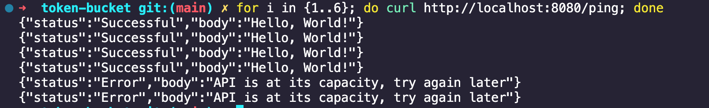

# rate-limiting
Rate limit with go to prevent the app from dos attack.

### I will implement rate limiting using 3 techniques 
* ## Per-client rate limit:
  * 
* ## Use Token bucket:
* ## Use toolbooth:
